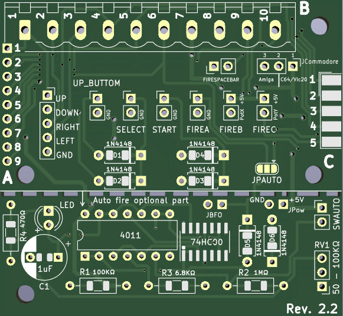

# 5plusbuttonsJoystick
5+1 Buttons Joystick for CBM 64/Vic 20 or AMIGA

[Joystick Tester PRG for C64](Joystick5plus1Test.prg)

## Schematics

[Pdf](Joy5Plus2.1.pdf)

**Appareance**

|||
|:---:|:---:|
|||

## DIY a modern multi button joystick for your C64
Since many, many years, a 3 button joystick for C64 is well known, but unfortunately not very widespread.
Only the C64GS had some games which officially supported a second joystick button, and since the C64GS came out very late in the C64's lifespan, it never became common.
Standard joystick ports on C64 (and Vic20) has the necessary hardware for 3 fire buttons, using the standard fire and the two connections POTX and POTY.
This simple project adds two more buttons that uses two additional logic states to use them in two buttons "Select" and "Start".

These two logic states are the simultaneousonly closing of the "UP" and "Down" circuits for the "Select" state/button and the simultaneous closing of the "Right" and "Left" circuits for the "Start" state/button, impossible to obtain in reality using the movement stick but identifiable by software. In this case the "Start" and "Select" buttons are perfectly usable for menus and choices to make when you are out of the action.

### Revision 2.2

* Pin-Layout for the SUB-D Connector corrected. It was a male connector and not a female connector.
* D6 silkscreen was reversed. Now it is flipped and in the right orientation.
* JPAUTO silkscreen corrected.

### C64/Vic20 or AMIGA
Using **JCommodore** connector it is possible to configure whether the joystick is for a C64/Vic20 or for an Amiga. I recommend using an internal selector/jumper or soldering the right pads with a jumper wire. It is possible to use an external selector, but BEWARE, pressing the 2nd fire or the 3rd fire with the selector in the wrong position, the computer could suffer a short circuit shock.

JCommodore position 1-2 : C64/Vic20

JCommodore position 2-3 : Amiga

JCommodore empty: 2nd and 3rd fire disabled.

### SPACEBAR simulator
Using **FIRESPACEBAR** connector, it's possible to simulate pressing the space bar. To do this it is necessary to bring the fire pin/signal of joystick port #1 to input 10 of connector B. Obviously to do this you have to add a second joystick connector to port 1 and bring 10 and not 9 signals/wires to the PCB.

### AutoFire optional part

With version 2.0 I added an optional part for managing the autofire. It works primarily via a CMOS NAND logic chip (4011 if you use a DIP14 or a 74HC00 if you use an SMD SOIC14). Be careful, TTL logic chips, 74LS or 74HCT, are not good. If you do not want to use this part, it can be removed by breaking the dotted part with the horizontal holes. However, this optional part, on its own, can be used to add autofire to a pre-existing joystick. In this case, use **JPow** to get power to it and **JBFO** for the Fire button. The **SWAUTO** jumper is used to select standard fire (closed) or autofire (open). If the optional autofire part remains attached to the main part of the PCB, then **JPow** and **JBFO** must remain empty.
The autofire speed is adjusted via the 50-100K ohm potentiometer attached to **RV1**.
If you want to use the optional part for the autofire, in addition to inserting all the necessary components, you must solder pads 2 and 3 of **JPAUTO**. Otherwise, solder pads 1 and 2. If you leave **JPAUTO** without soldering, the Fire button will not work.

### How to route joystick port signals to the PCB

You can choose to connect the PCB, positioned inside the joystick case, using either a 9-pole joystick cable or a joystick extension cable with male and female DB9 ports at its ends. In the first case you can use either connector A or connector B (the difference is that in connector B you can put different types of connectors with screw connection of the wires). In the second case you have to solder a female DB9 connector into the PCB.

### Internal joystick case connections

Use the vertical 5-hole connector with **UP**, **DOWN**, **RIGHT**, **LEFT** and **GND** to connect the joystick stick to the PCB.
UP button (optinal) to **UP_BUTTON** connector/jumper, Select button (optional) to **SELECT** connector/jumper,  Start button (optional) to **START** connector/jumper, Fire button to **FIREA** connector/jumper, 2nd Fire button to **FIREB** connector/jumper and 3rd Fire button to **FIREC** connector/jumper.

Components
---------
* U1: 4011 DIP14 or 74HC00 SOIC14 (otional - for Autofire part)
* D1, D2, D3, D4, D5 e D6: 1N4148 tht or smd 1206 (optinal  - for START and SELCT buttons or for Autofire part)
* DB9 female serial port (if you want to use a joystick extension cable)
* Rv1: 50-100KΩ potentiometer (otional - for Autofire part)
* R1: 100KΩ tht or smd 1206 (otional - for Autofire part)
* R2: 1MΩ tht or smd 1206 (otional - for Autofire part)
* R3: 6.8KΩ tht or smd 1206 (otional - for Autofire part)
* R4: 470Ω tht or smd 1206 (otional - for Autofire part)
* C1: 1uF tht or smd 805 (otional - for Autofire part)
* DL1: Led

**JPAUTO config**

|With Autofire|Without AutoFire|Wrong choice|
|:---:|:---:|:---:|
|||Solder all or solder nothing|

## Some games that support additional buttons
Many early home computers and game consoles came with the classic one button joystick, and supporting more than that was rare. The following list omits the later released systems where controllers with two or more buttons became standard. (like MSX, SEGA Mastersystem, etc):

* Alien 8 by Rod & Emu - 2nd button can be used for pick/drop in directional mode.
* Battle Command (Ocean Cartridge) - 2nd button toggles between tank- and menu control, hold for menu bar
* Chase HQ2 (C64GS Cartridge) - 2nd button enables turbo boost
* Double Dragon (Ocean)
* Giana Sisters 30th Anniversary Hack by The Seven-A-Three (WIP)
* Last Ninja Remix (C64GS Cartridge) - The button used to start the game becomes the "fighting moves" button, the other button becomes the "weapon select" button. The selection can be changed at the beginning of each level by pressing the respective button to start it.
* Navy Seals (Ocean) - 2nd button restarts the game
* +Myth (C64GS Cartridge) - hold 2nd button to change weapon with left+right
* Pang (Ocean) - 2nd button pauses the game
* Paradroid Redux - "Press 2nd button while title screen is shown to start game in two-button mode. Use second button to go into transfer mode, first button for everything else."
* Robocop 2 (C64GS Cartridge) - optionally use 2nd button for "jump"
* Spacegun - 2nd button to change weapon
* Super Mario Bros (Zeropaige version) - optionally use 2nd button for "jump"
* Turbo Charge - 2nd button enables turbo boost
etc etc

## Some games modded by me
* Commando (second fire to throw a granate) [Commando](https://github.com/crystalct/5plusbuttonsJoystick/raw/main/commando.d64);
* Retaliate64-CE (second fire activate shield, third fire launch missile) [Retaliate64-CE](https://github.com/crystalct/5plusbuttonsJoystick/raw/main/retaliate-ce.prg);
* 1942 (second fire to pull up)[1942](https://github.com/crystalct/5plusbuttonsJoystick/raw/main/1942-2ndfire.prg);
* Scramble - 2015 version (separate fire and second fire for bombs, as in the arcade version) [Scramble](https://github.com/crystalct/5plusbuttonsJoystick/raw/main/scramble%5B2015%5D_2nd_fire.prg);
* Blue Max (Only second fire to drop boms) [Blue Max](https://github.com/crystalct/5plusbuttonsJoystick/raw/main/BlueMax_2nd_fire.prg);
* Wizball (2nd fire to choose the extra that is flashing at the upper border of the screen) [Wizball](https://github.com/crystalct/5plusbuttonsJoystick/raw/main/wizball-2nd-fire.prg);
* Rambo: First Blood Part II (2nd fire to choose weapon and to make action) [Rambo: First Blood Part II](https://github.com/crystalct/5plusbuttonsJoystick/raw/main/rambo-first-blood-2nd-fire.prg);
* Green Beret: (2nd fire to use additional weapon) [Green Beret](https://github.com/crystalct/5plusbuttonsJoystick/raw/main/green-beret-2nd-fire.prg);
* Gryzor: (2nd fire to jump) [Gryzor](https://github.com/crystalct/5plusbuttonsJoystick/raw/main/gryzor-2nd-fire.prg);
* Turrican: (2nd fire to activate two energy lines) [Turrican](https://github.com/crystalct/5plusbuttonsJoystick/raw/main/turrican-2nd-fire.zip);
* Turrican II: (2nd fire to activate two energy lines) [Turrican II](https://github.com/crystalct/5plusbuttonsJoystick/raw/main/Turrican2-2nd-fire.zip);
* Turbo Girl: (2nd fire to jump) [Turbo Girl](https://github.com/crystalct/5plusbuttonsJoystick/raw/main/turbogirl-2nd-fire.prg);
* Look here for the complete and updated [list](http://wiki.icomp.de/wiki/DE-9_Joystick#C64).

PCB
---
You, can get pcb at [PCBWay](https://www.pcbway.com/project/shareproject/DIY_5_buttons_joystick_for_Commodore_64_Vic20_autofire_943caf84.html)

